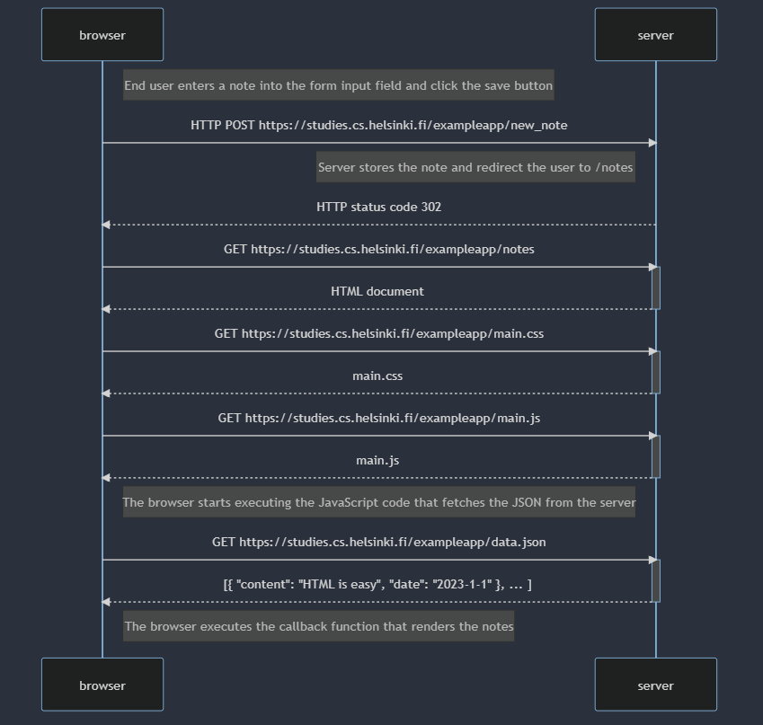
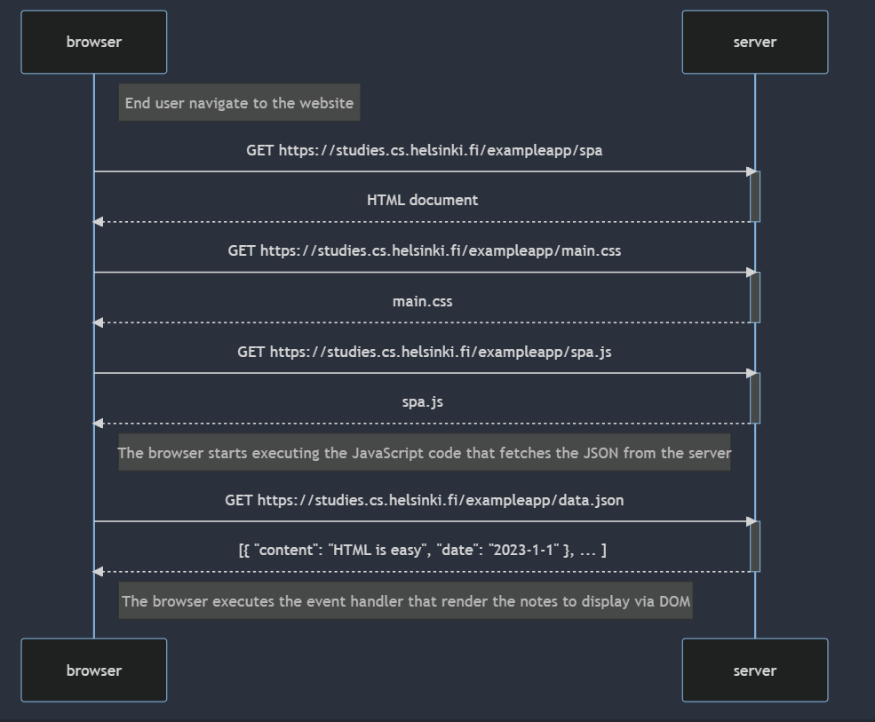
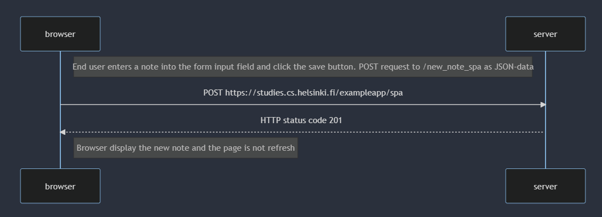

# 0.4: New note



```
sequenceDiagram
    participant browser
    participant server

    Note right of browser: End user enters a note into the form input field and click the save button

    browser->>server: HTTPPOST https://studies.cs.helsinki.fi/exampleapp/new_note

    Note left of server: Server stores the note and redirect the user to /notes

    server-->>browser: HTTP status code 302

    browser->>server: GET https://studies.cs.helsinki.fi/exampleapp/notes
    activate server
    server-->>browser: HTML document
    deactivate server

    browser->>server: GET https://studies.cs.helsinki.fi/exampleapp/main.css
    activate server
    server-->>browser: main.css
    deactivate server

    browser->>server: GET https://studies.cs.helsinki.fi/exampleapp/main.js
    activate server
    server-->>browser: main.js
    deactivate server

    Note right of browser: The browser starts executing the JavaScript code that fetches the JSON from the server

    browser->>server: GET https://studies.cs.helsinki.fi/exampleapp/data.json
    activate server
    server-->>browser: [{ "content": "HTML is easy", "date": "2023-1-1" }, ... ]
    deactivate server

    Note right of browser: The browser executes the callback function that renders the notes
```
# 0.5: Single page app



```
sequenceDiagram
    participant browser
    participant server

    Note right of browser: End user navigate to the website

    browser->>server: GET https://studies.cs.helsinki.fi/exampleapp/spa
    activate server
    server-->>browser: HTML document
    deactivate server

    browser->>server: GET https://studies.cs.helsinki.fi/exampleapp/main.css
    activate server
    server-->>browser: main.css
    deactivate server

    browser->>server: GET https://studies.cs.helsinki.fi/exampleapp/spa.js
    activate server
    server-->>browser: spa.js
    deactivate server

    Note right of browser: The browser starts executing the JavaScript code that fetches the JSON from the server

    browser->>server: GET https://studies.cs.helsinki.fi/exampleapp/data.json
    activate server
    server-->>browser: [{ "content": "HTML is easy", "date": "2023-1-1" }, ... ]
    deactivate server

    Note right of browser: The browser executes the event handler that render the notes to display via DOM
```
# 0.6: New note in Single page app



```
sequenceDiagram
    participant browser
    participant server

    Note right of browser: End user enters a note into the form input field and click the save button. POST request to /new_note_spa as JSON-data

    browser->>server: POST https://studies.cs.helsinki.fi/exampleapp/spa
    activate server
    server-->>browser: HTTP status code 201
    
    Note right of browser: Browser display the new note and the page is not refresh
```
